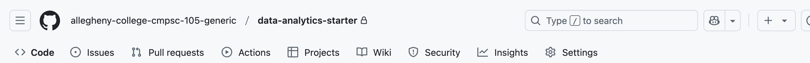
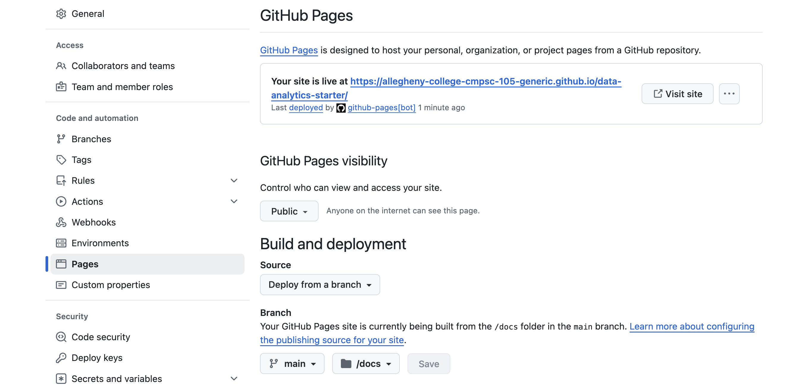

# Final Project

Before you begin, turn this repository into a public website.
Follow the instructions below to build the website.

0. Go to the Settings tab in GitHub on the right side of the top tabs.

    

1. On the left, look for pages. Click on pages. Then select the options to deploy from branch, main, docs, and save what you have so far.

2. It might take a minute or two to build, but note that at this stage, your website will be private.

3. After your site has a private URL, select the public option. This step is required after the steps above are done.
Save again. At this stage, your pages settings should look like those shown in the image below.

    

4. Check your GitHub Actions builds until your website URL is activated!

5. Finally, paste your public URL into the Discord Thread for final urls.

    It should have your GitHub username at the end:
    https://allegheny-college-cmpsc-105-spring-2025.github.io/final-project-emgraber/

6. Now you can click on the `final_project_starter.ipynb` to get started
